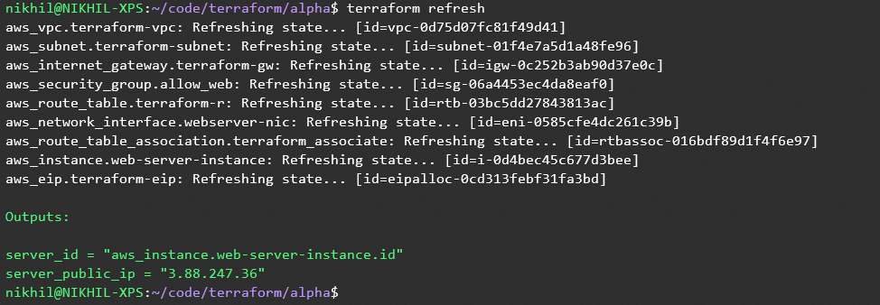
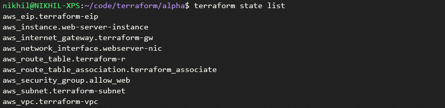

## Terraform Commands

### Terraform Refresh

Terreaform refresh can be used to refresh ex: get additional outputs without terrafrom apply

### Terraform State List

### Terraform Target

-target flag can be used to apply or destroy individual resources in tf

## Terrafrom Variables

Variables can be assigned valuses during run time or pass via command line arguments or defined in default file terraform.tfvars
